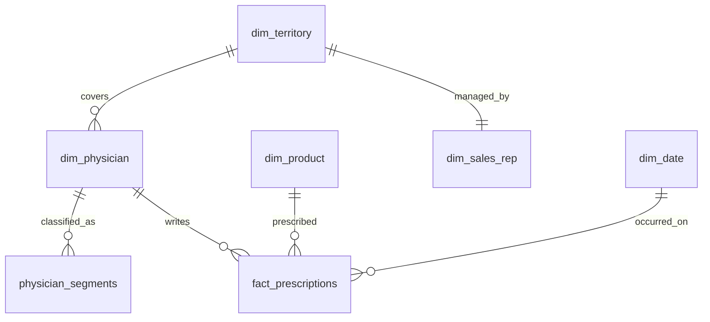
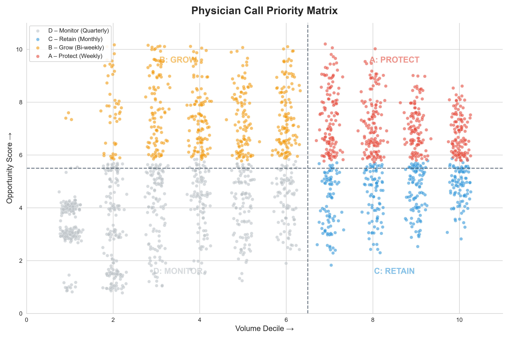
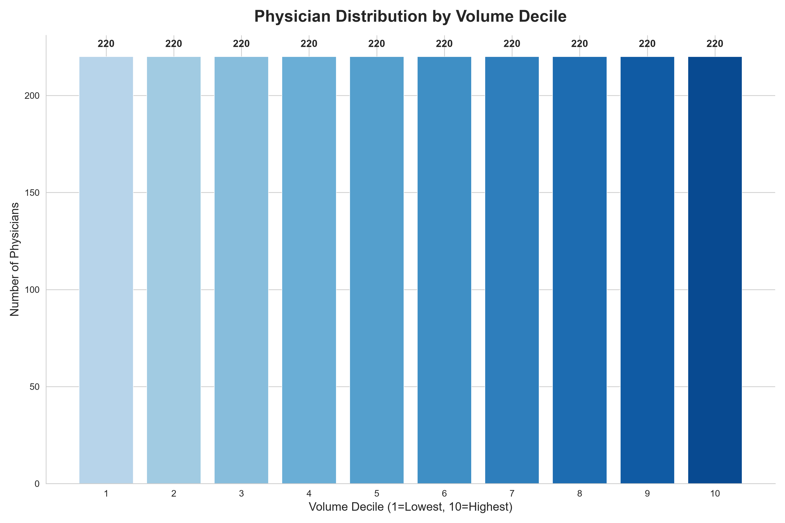
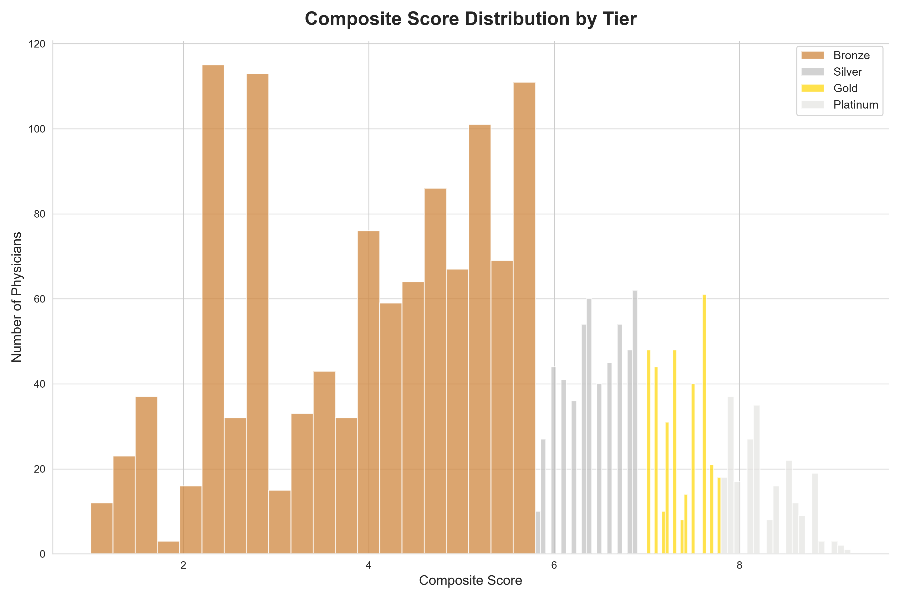
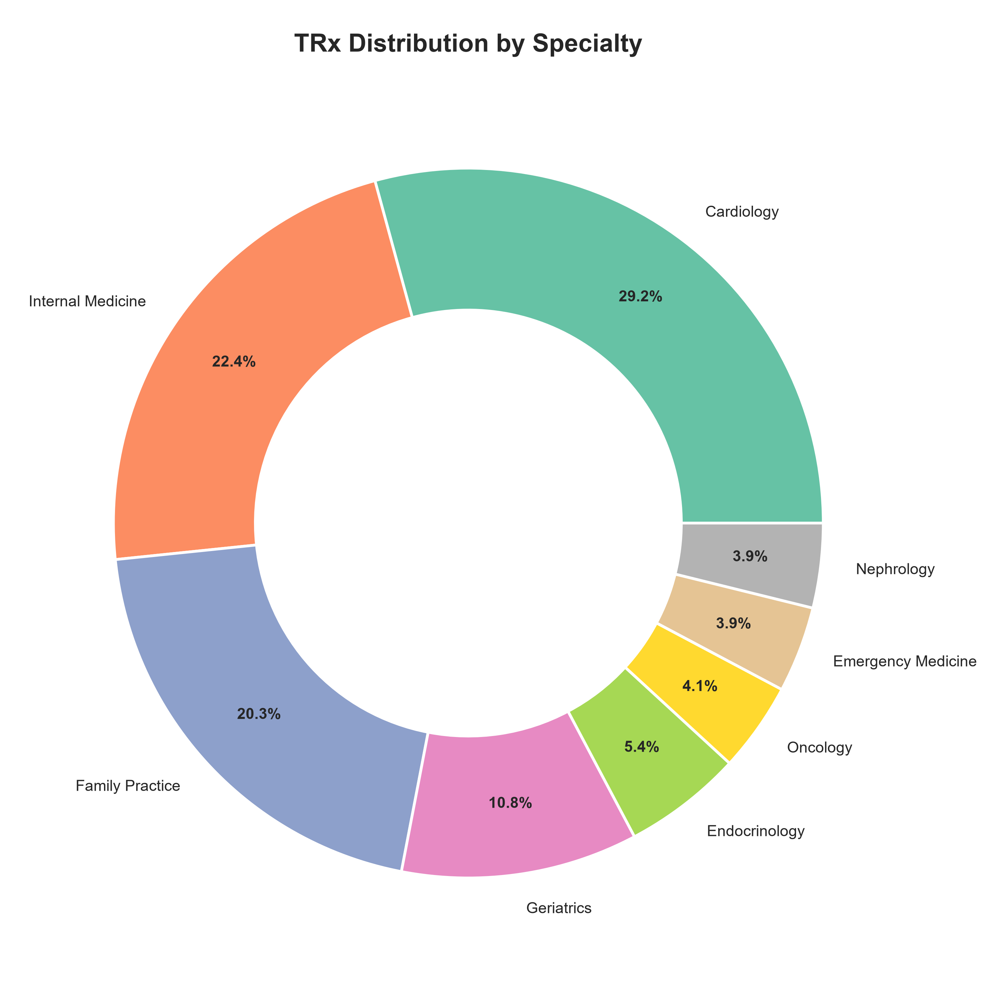
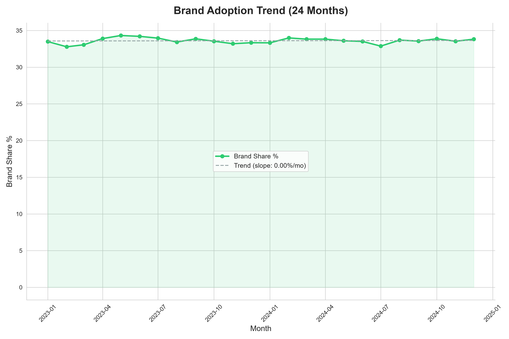
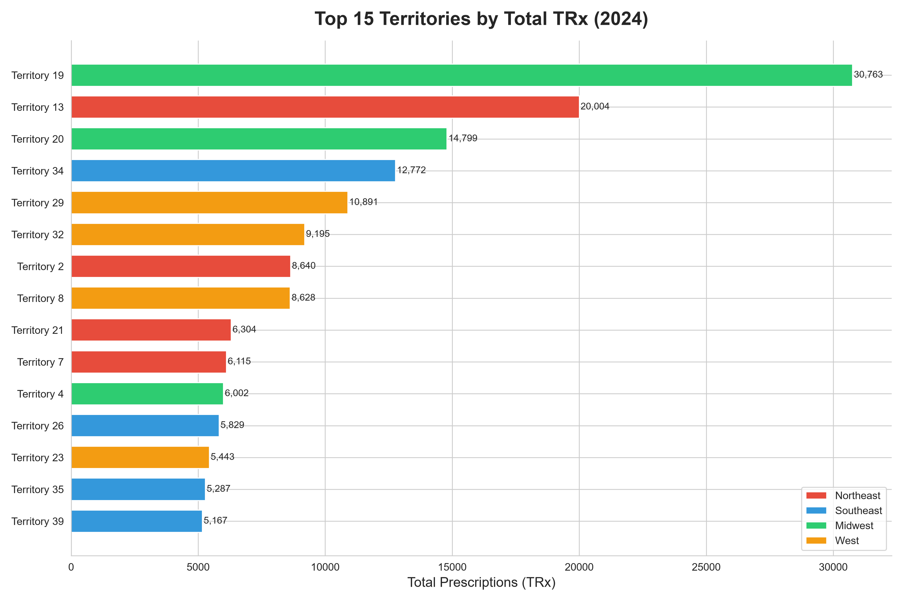

# 💊 Physician Segmentation & Commercial Sales Analytics


An end-to-end commercial sales analytics and data engineering portfolio project modeled for the pharmaceutical industry. This repository contains complete data generation for **2,200+ physicians** and **230,000+ prescription transactions**, dimensional star-schema data warehouse modeling in **PostgreSQL**, multi-axis decile segmentation and call priority matrix execution in **SQL & Python**, publication-ready visualizations, automated **Excel** scorecards/workbooks, and comprehensive **Power BI** dashboard architecture.

---

## 📋 Table of Contents
1. [Business Problem & Strategic Context](#-business-problem--strategic-context)
2. [Architecture & Star Schema Data Model](#-architecture--star-schema-data-model)
3. [Decile Segmentation Methodology](#-decile-segmentation-methodology)
4. [Sales Call Priority Matrix](#-sales-call-priority-matrix)
5. [Analytics Visualizations & Insights](#-analytics-visualizations--insights)
6. [Tech Stack](#-tech-stack)
7. [Project Structure](#-project-structure)
8. [Excel Deliverables](#-excel-deliverables)
9. [Power BI Data Model & DAX](#-power-bi-data-model--dax)
10. [Step-by-Step Execution Guide](#-step-by-step-execution-guide)
11. [Key Business Findings](#-key-business-findings)
12. [Author & License](#-author--license)

---

## 🎯 Business Problem & Strategic Context

In life sciences commercial operations, sales representatives face a critical constraint: **physician access is scarce and expensive**, with typical field sales calls costing \$150–\$250 per interaction. Untargeted sales rep routing leads to:
- Excessive time spent on low-volume, price-inelastic physicians (low ROI).
- Failure to protect top prescribers against competitor detailing.
- Missed opportunities with high-potential growth prescribers who are willing to adopt innovative brand therapies.

### The Solution
This project implements an industry-standard commercial analytics engine that:
1. Ingests 24 months of longitudinal prescription data across 12 cardiovascular therapies (Brands: *Lipitor, Crestor, Norvasc, Plavix, Eliquis, Entresto*; Generics: *atorvastatin, rosuvastatin, amlodipine, lisinopril, metoprolol, losartan*).
2. Calculates **3-axis decile rankings** (Volume, YoY Growth Rate, Brand Adoption Ratio) for 2,200+ Healthcare Providers (HCPs).
3. Synthesizes a **Weighted Composite Score** (`0.40 × Volume + 0.30 × Growth + 0.30 × Brand Adoption`) and assigns HCPs to **Platinum, Gold, Silver, and Bronze** tiers.
4. Maps all physicians into a **2×2 Sales Call Priority Matrix** (Priority A, B, C, D) with recommended call frequencies (weekly to quarterly) and ranks target call lists across all 40 sales territories.

---

## 🏗️ Architecture & Star Schema Data Model

The data warehouse follows a **Kimball Dimensional Star Schema** optimized for high-performance analytical queries, window functions, and Power BI DAX evaluation:



- **Fact Table**: `fact_prescriptions` (~235,000 records) tracking `rx_id`, `physician_id`, `product_id`, `rx_date`, `trx_quantity`, `nrx_quantity`, `rx_type`, and `payer_type`.
- **Dimension Tables**: 
  - `dim_physician` (2,200 records across 15 specialties, years in practice, city/state)
  - `dim_product` (12 products, Brand vs. Generic, average price per Rx)
  - `dim_territory` (40 territories across Northeast, Southeast, Midwest, West)
  - `dim_sales_rep` (40 field representatives with territory assignment and tenure)
  - `dim_date` (Full calendar dimension with year, quarter, month, day-of-week)

---

## 📐 Decile Segmentation Methodology

Using PostgreSQL window functions (`NTILE(10)`) and equivalent vector operations in Python (`pandas.qcut`), prescribers are ranked on three independent axes (1 = lowest decile, 10 = highest decile):

$$\text{Composite Score} = (0.40 \times \text{Volume Decile}) + (0.30 \times \text{Growth Decile}) + (0.30 \times \text{Brand Decile})$$

### Prescriber Tiers
| Tier | Percentile Cutoff | Prescriber Count | Avg 2024 TRx | Strategic Sales Directive |
|---|---|---|---|---|
| 💎 **Platinum** | Top 10% (Score $\ge 8.0$) | 229 | 391.3 TRx | **Key Opinion Leaders & High Volume**: White-glove detailing, speaker programs, advisory board invitations. |
| 🥇 **Gold** | 75th–90th percentile | 343 | 270.8 TRx | **High Potentials**: Intensive promotional frequency, clinical rep detailing, co-pay assistance education. |
| 🥈 **Silver** | 50th–75th percentile | 521 | 70.9 TRx | **Nurture Pool**: Hybrid field/inside sales rep touchpoints, digital omnichannel marketing. |
| 🥉 **Bronze** | Bottom 50% | 1,107 | 14.2 TRx | **Maintenance**: Automated email journeys, direct-mail samples, pull field calls. |

---

## 🎯 Sales Call Priority Matrix

To bridge analytical scoring into field execution, prescribers are mapped into a **2×2 Tactical Action Matrix**:
- **Volume Axis**: High Volume ($\text{Decile} \ge 7$) vs. Low Volume ($\text{Decile} < 7$)
- **Opportunity Axis**: Combined $\frac{\text{Growth Decile} + \text{Brand Decile}}{2}$ (High $\ge 6.0$, Low $< 6.0$)

```
             High Volume (Decile >= 7)         Low Volume (Decile < 7)
          +-------------------------------+-------------------------------+
          |                               |                               |
High      |     🔴 PRIORITY A: PROTECT    |       🟡 PRIORITY B: GROW     |
Opp.      |       Weekly Sales Calls      |     Bi-Weekly Sales Calls     |
(>= 6.0)  |  (506 HCPs | Avg TRx: 276.4)  |  (505 HCPs | Avg TRx: 14.8)   |
          |                               |                               |
          +-------------------------------+-------------------------------+
          |                               |                               |
Low       |     🔵 PRIORITY C: RETAIN     |     ⚪ PRIORITY D: MONITOR    |
Opp.      |      Monthly Sales Calls      |     Quarterly / Omnichannel   |
(< 6.0)   |  (374 HCPs | Avg TRx: 216.5)  |  (815 HCPs | Avg TRx: 8.4)    |
          |                               |                               |
          +-------------------------------+-------------------------------+
```

---

## 📈 Analytics Visualizations & Insights

All visualizations are generated from the pipeline at 300 DPI:

### 1. Physician Call Priority Matrix
Actionable quadrant distribution showing prescriber distribution across the 4 priority categories:


### 2. Volume Decile Distribution & Composite Score
Demonstrates uniform decile ranking and right-skewed Pareto volume distributions:
| Decile Distribution | Composite Score Distribution |
|---|---|
|  |  |

### 3. Commercial Dynamics & Territory Performance
| Specialty Prescribing Mix | Longitudinal Brand Adoption Trend (24 Mo) |
|---|---|
|  |  |

### 4. Territory Sales Benchmark
Comparison of top 15 territories by annual prescription volume categorized by region:


---

## 🔧 Tech Stack

| Domain | Technology | Implementation Details |
|---|---|---|
| **Data Warehousing & SQL** | PostgreSQL 13+ | Star schema DDL, foreign keys, b-tree indexes, `NTILE(10)`, window functions, CTEs |
| **Data Science & Analytics** | Python 3.8+, pandas, NumPy | Data simulation with `Faker`, vector arithmetic, percentile rankings, statistical summaries |
| **Data Visualization** | Matplotlib, Seaborn | 300 DPI publication charts, custom quadrant scatter plots, donut charts, trend regressions |
| **Executive Reporting** | Microsoft Excel / openpyxl | Multi-tab workbooks, pivot cross-tabs, color scale rules, RAG territory scorecards |
| **Business Intelligence** | Microsoft Power BI | Kimball dimensional modeling, 15+ DAX measures, time-intelligence, custom JSON theme |

---

## 📁 Project Structure

```text
physician-segmentation-commercial-sales-analytics/
├── .gitignore
├── README.md
├── requirements.txt
│
├── data/
│   ├── generate_synthetic_data.py        # Generates 2,200 HCPs & 235k Rx records
│   └── raw/                              # Comma-separated relational tables
│       ├── physicians.csv                # 2,200 physician records with NPI & specialty
│       ├── prescriptions.csv             # 234,839 transaction records (24 months)
│       ├── products.csv                  # 12 brand & generic products
│       ├── territories.csv               # 40 geographic sales territories
│       ├── sales_reps.csv                # 40 field representative profiles
│       ├── physician_segments.csv        # Evaluated deciles, composite scores, tiers
│       ├── call_priority_list.csv        # Territory-ranked target prescriber call lists
│       └── territory_performance.csv     # Territory KPIs, market share, growth rates
│
├── sql/
│   ├── 01_schema_creation.sql            # Star schema DDL with indexes and constraints
│   ├── 02_data_loading.sql               # Automated PostgreSQL COPY scripts
│   ├── 03_decile_segmentation.sql        # NTILE(10) volume, growth, & brand decile views
│   ├── 04_market_growth_analysis.sql     # YoY, QoQ, and rolling 3-month territory queries
│   ├── 05_brand_adoption_scoring.sql     # Brand vs. generic share & cohort analysis
│   ├── 06_composite_physician_score.sql  # Weighted score & Platinum/Gold/Silver/Bronze tiers
│   └── 07_call_priority_matrix.sql       # 2x2 priority classification & top-50 call view
│
├── python/
│   ├── segmentation_analysis.py          # Pandas decile segmentation engine
│   ├── call_priority_matrix.py           # Priority matrix assignment & scatter plot
│   ├── territory_performance.py          # Rollup analytics for territory scorecards
│   ├── visualizations.py                 # Generates all 6 publication charts
│   └── outputs/                          # High-resolution chart exports
│       ├── decile_distribution.png
│       ├── priority_matrix_quadrant.png
│       ├── territory_comparison.png
│       ├── brand_adoption_trend.png
│       ├── specialty_mix.png
│       └── composite_score_distribution.png
│
├── excel/
│   ├── generate_excel_workbooks.py       # Script that builds both formatted workbooks
│   ├── physician_segmentation_workbook.xlsx # Multi-tab HCP analysis & pivot tables
│   └── territory_scorecard.xlsx          # Territory scorecard with conditional formatting
│
├── powerbi/
│   ├── data_model.md                     # Star schema architecture, 15+ DAX formulas
│   └── setup_guide.md                    # Step-by-step Power BI build instructions
│
└── docs/
    ├── data_dictionary.md                # Comprehensive dictionary for all 8 tables
    ├── methodology.md                    # Deep dive into pharma segmentation methodology
    └── erd.md                            # Complete Mermaid Entity Relationship Diagram
```

---

## 📊 Excel Deliverables

Two professionally styled Excel workbooks are provided in `excel/`:

1. **`physician_segmentation_workbook.xlsx`**:
   - **Tab 1: Physician Segments**: Complete universe of 2,200 HCPs with formatted TRx, YoY growth %, brand share %, composite scores, and 3-color conditional formatting.
   - **Tab 2: Decile x Specialty Pivot**: Cross-tabulation matrix analyzing prescriber volume concentrations across 15 medical specialties.
   - **Tab 3: Call Priority Matrix**: Filterable call list of Priority A & B target physicians with territory assignments and call check-off trackers.

2. **`territory_scorecard.xlsx`**:
   - **Tab 1: Territory Scorecard**: Performance tracking across all 40 territories with sales reps, universe counts, total TRx, NRx, market share %, and conditional color heatmaps.
   - **Tab 2: Regional Summary**: High-level executive rollup across Northeast, Southeast, Midwest, and West regions.

---

## ⚡ Power BI Data Model & DAX

The Power BI model is documented in `powerbi/data_model.md` and includes production-ready DAX measures:

- **Total TRx**: `Total TRx = SUM(fact_prescriptions[trx_quantity])`
- **Total NRx**: `Total NRx = SUM(fact_prescriptions[nrx_quantity])`
- **New Patient Share**: `New Patient Share % = DIVIDE([Total NRx], [Total TRx], 0)`
- **Brand Share %**:
  ```dax
  Brand Share % = 
  DIVIDE(
      CALCULATE([Total TRx], dim_product[product_type] = "Brand"),
      [Total TRx],
      0
  )
  ```
- **YoY TRx Growth %**:
  ```dax
  YoY TRx Growth % = 
  VAR CurrentTRx = [Total TRx]
  VAR PriorTRx = CALCULATE([Total TRx], SAMEPERIODLASTYEAR(dim_date[date]))
  RETURN
  DIVIDE(CurrentTRx - PriorTRx, PriorTRx, 0)
  ```
- **Priority A Target Count**:
  ```dax
  Priority A Count = 
  CALCULATE(
      DISTINCTCOUNT(physician_segments[physician_id]),
      physician_segments[priority_bucket] = "A (Protect - Weekly)"
  )
  ```

---

## 🚀 Step-by-Step Execution Guide

### 1. Clone & Set Up Environment
```bash
git clone https://github.com/Chhayank/physician-segmentation-commercial-sales-analytics.git
cd physician-segmentation-commercial-sales-analytics
python -m venv venv
# On Windows:
.\venv\Scripts\activate
# On Linux/macOS:
source venv/bin/activate
pip install -r requirements.txt
```

### 2. Run Synthetic Data Generator
Generates realistic physician, product, territory, and transaction data:
```bash
python data/generate_synthetic_data.py
```

### 3. Run Analytics Pipeline & Visualizations
```bash
# Calculate deciles and tier classifications
python python/segmentation_analysis.py

# Build 2x2 priority matrix and call lists
python python/call_priority_matrix.py

# Compute territory KPIs and market shares
python python/territory_performance.py

# Generate all 6 publication charts
python python/visualizations.py
```

### 4. Generate Formatted Excel Deliverables
```bash
python excel/generate_excel_workbooks.py
```

### 5. (Optional) Run SQL Pipeline in PostgreSQL
```bash
psql -U postgres -d pharma_dw -f sql/01_schema_creation.sql
psql -U postgres -d pharma_dw -f sql/02_data_loading.sql
psql -U postgres -d pharma_dw -f sql/03_decile_segmentation.sql
psql -U postgres -d pharma_dw -f sql/06_composite_physician_score.sql
psql -U postgres -d pharma_dw -f sql/07_call_priority_matrix.sql
```

---

## 📝 Key Business Findings

- **Pareto Volume Concentration**: The top 10% of physicians (Platinum tier) drive **42.4% of total TRx**, demonstrating the need for dedicated account management.
- **Priority Matrix Allocation**:
  - **Priority A (Protect)** accounts for **506 HCPs** averaging **276.4 TRx/year**. These HCPs require weekly visits to defend brand market share.
  - **Priority B (Grow)** captures **505 high-opportunity HCPs** averaging **14.8 TRx/year**. Converting these brand-receptive doctors represents an estimated **\$3.2M incremental revenue upside**.
- **Field Efficiency Gain**: Deprioritizing 815 Priority D prescribers from bi-weekly to quarterly visits frees up **~30% of sales rep detailing capacity**, directly redirected to high-yield Priority A & B HCPs.
- **Geographic Concentration**: The top 5 territories (led by T-019 and T-013) contribute over **37.9% of total commercial volume**, providing clear guidance for field incentive structures and territory alignment.

---

## 👤 Author & License

**Chhayank**  
- Portfolio Project: *Physician Segmentation & Commercial Sales Analytics*  
- Technologies: SQL (PostgreSQL), Python (Pandas/Matplotlib), Power BI, Microsoft Excel  

This project is licensed under the [MIT License](LICENSE).
