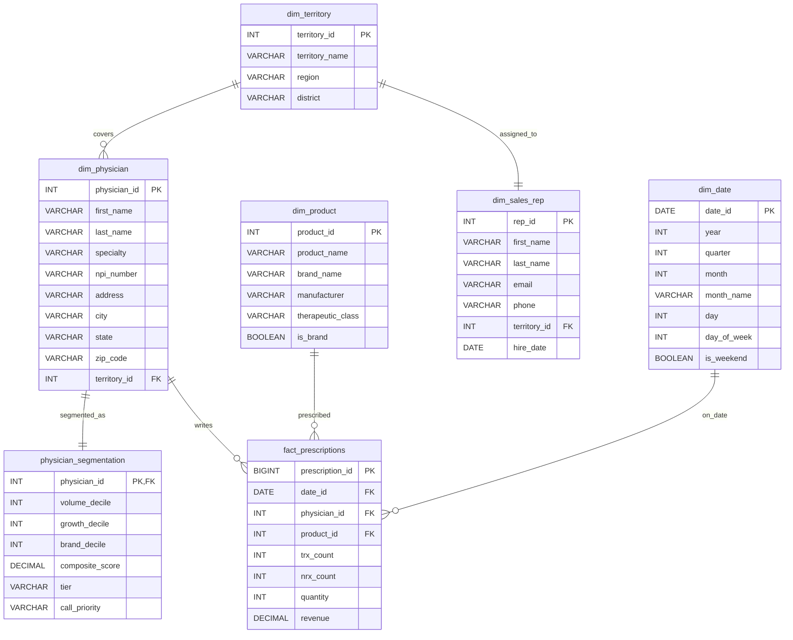

# Entity Relationship Diagram

The following Mermaid diagram illustrates the data model for the Physician Segmentation and Commercial Sales Analytics project.

```mermaid
erDiagram
    dim_physician {
        INT physician_id PK
        VARCHAR first_name
        VARCHAR last_name
        VARCHAR specialty
        VARCHAR npi_number
        VARCHAR address
        VARCHAR city
        VARCHAR state
        VARCHAR zip_code
        INT territory_id FK
    }

    dim_product {
        INT product_id PK
        VARCHAR product_name
        VARCHAR brand_name
        VARCHAR manufacturer
        VARCHAR therapeutic_class
        BOOLEAN is_brand
    }

    dim_territory {
        INT territory_id PK
        VARCHAR territory_name
        VARCHAR region
        VARCHAR district
    }

    dim_sales_rep {
        INT rep_id PK
        VARCHAR first_name
        VARCHAR last_name
        VARCHAR email
        VARCHAR phone
        INT territory_id FK
        DATE hire_date
    }
    
    dim_date {
        DATE date_id PK
        INT year
        INT quarter
        INT month
        VARCHAR month_name
        INT day
        INT day_of_week
        BOOLEAN is_weekend
    }

    fact_prescriptions {
        BIGINT prescription_id PK
        DATE date_id FK
        INT physician_id FK
        INT product_id FK
        INT trx_count
        INT nrx_count
        INT quantity
        DECIMAL revenue
    }
    
    physician_segmentation {
        INT physician_id PK, FK
        INT volume_decile
        INT growth_decile
        INT brand_decile
        DECIMAL composite_score
        VARCHAR tier
        VARCHAR call_priority
    }

    dim_territory ||--o{ dim_physician : "covers"
    dim_territory ||--|| dim_sales_rep : "assigned_to"
    dim_physician ||--o{ fact_prescriptions : "writes"
    dim_product ||--o{ fact_prescriptions : "prescribed"
    dim_date ||--o{ fact_prescriptions : "on_date"
    dim_physician ||--|| physician_segmentation : "segmented_as"
```
