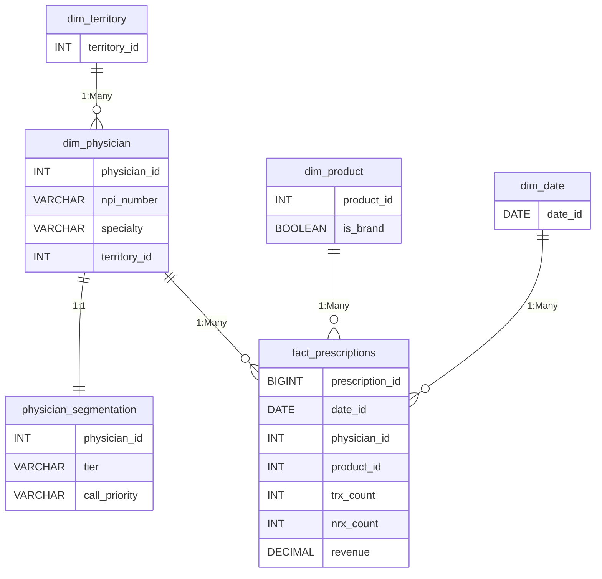

# Power BI Data Model & DAX Guide

## Data Model

The Power BI implementation uses a classic Star Schema design, optimizing for performance and ease of querying.

### Star Schema Diagram



### Relationship Definitions
- `dim_physician[physician_id]` -> `fact_prescriptions[physician_id]` (1:Many, Single direction)
- `dim_product[product_id]` -> `fact_prescriptions[product_id]` (1:Many, Single direction)
- `dim_date[date_id]` -> `fact_prescriptions[date_id]` (1:Many, Single direction)
- `dim_territory[territory_id]` -> `dim_physician[territory_id]` (1:Many, Single direction)
- `dim_physician[physician_id]` -> `physician_segmentation[physician_id]` (1:1, Both directions)

### Data Source
All tables are sourced from CSV files located in the `data/processed/` directory.

---

## DAX Measures

Below are the core DAX measures required for the dashboard.

### Volume & Revenue
```dax
Total TRx = SUM('fact_prescriptions'[trx_count])

Total NRx = SUM('fact_prescriptions'[nrx_count])

Total Revenue = SUM('fact_prescriptions'[revenue])

Avg TRx per Physician = 
DIVIDE(
    [Total TRx],
    DISTINCTCOUNT('fact_prescriptions'[physician_id])
)
```

### Growth & Time Intelligence
```dax
Same Period Last Year TRx = 
CALCULATE(
    [Total TRx],
    SAMEPERIODLASTYEAR('dim_date'[date_id])
)

YoY Growth % = 
DIVIDE(
    [Total TRx] - [Same Period Last Year TRx],
    [Same Period Last Year TRx]
)

Previous Quarter TRx = 
CALCULATE(
    [Total TRx],
    PREVIOUSQUARTER('dim_date'[date_id])
)

QoQ Growth % = 
DIVIDE(
    [Total TRx] - [Previous Quarter TRx],
    [Previous Quarter TRx]
)

Running Total TRx = 
CALCULATE(
    [Total TRx],
    DATESYTD('dim_date'[date_id])
)
```

### Market & Brand Share
```dax
Brand TRx = 
CALCULATE(
    [Total TRx],
    'dim_product'[is_brand] = TRUE()
)

Brand Share % = 
DIVIDE(
    [Brand TRx],
    [Total TRx]
)

Generic Share % = 
1 - [Brand Share %]

Market Share by Territory = 
DIVIDE(
    [Total TRx],
    CALCULATE([Total TRx], ALL('dim_territory'))
)

New Patient Share = 
DIVIDE(
    [Total NRx],
    [Total TRx]
)
```

### Segmentation & Targeting
```dax
Physician Count by Tier = 
CALCULATE(
    COUNTROWS('dim_physician'),
    CROSSFILTER('dim_physician'[physician_id], 'physician_segmentation'[physician_id], Both)
)

Priority A Count = 
CALCULATE(
    COUNTROWS('physician_segmentation'),
    'physician_segmentation'[call_priority] = "A"
)

Priority B Count = 
CALCULATE(
    COUNTROWS('physician_segmentation'),
    'physician_segmentation'[call_priority] = "B"
)

Priority C Count = 
CALCULATE(
    COUNTROWS('physician_segmentation'),
    'physician_segmentation'[call_priority] = "C"
)

Priority D Count = 
CALCULATE(
    COUNTROWS('physician_segmentation'),
    'physician_segmentation'[call_priority] = "D"
)

Growth vs Target = 
VAR Target = 0.05
RETURN [YoY Growth %] - Target
```

---

## Dashboard Pages

### Page 1: Executive Summary
- **Visuals**: KPI Cards (Total TRx, Total Revenue, YoY Growth %, Brand Share %), Line Chart (TRx Trend over time), Filled Map (Territory Performance by Revenue).
- **Purpose**: High-level overview for leadership to gauge overall business health.

### Page 2: Physician Segmentation
- **Visuals**: Bar Chart (TRx by Volume Decile), Donut Chart (Physician Count by Tier), Matrix Table (Tier vs Average TRx).
- **Purpose**: Analyze the distribution and value of physician tiers. Includes drill-through to individual physician details.

### Page 3: Territory Performance
- **Visuals**: Clustered Bar Chart (TRx and NRx by Territory), Scorecard (YoY Growth vs Target by Region), Table (Sales Rep Comparison).
- **Purpose**: Allow district and regional managers to track performance across geographies and reps.

### Page 4: Call Priority Matrix
- **Visuals**: Scatter Chart / Quadrant Chart (Volume vs Brand Share, colored by Priority A/B/C/D), Data Table (Call List with Physician Names, Tiers, and Contact Info).
- **Purpose**: Actionable tool for Sales Reps to plan their routing and prioritize high-value targets. Includes slicers for Territory and Specialty.

---

## Color Theme

Save this as `PharmaTheme.json` and import it into Power BI to ensure consistent branding.

```json
{
    "name": "Pharma Analytics Theme",
    "dataColors": [
        "#004B87", 
        "#00A3E0", 
        "#87B940", 
        "#FDB813", 
        "#E87722", 
        "#63666A", 
        "#A6A6A6", 
        "#D0D0D0"
    ],
    "background": "#FFFFFF",
    "foreground": "#333333",
    "tableAccent": "#004B87",
    "visualStyles": {
        "*": {
            "*": {
                "fontFamily": [{ "value": "Segoe UI" }],
                "color": [{ "value": "#333333" }]
            }
        }
    }
}
```
