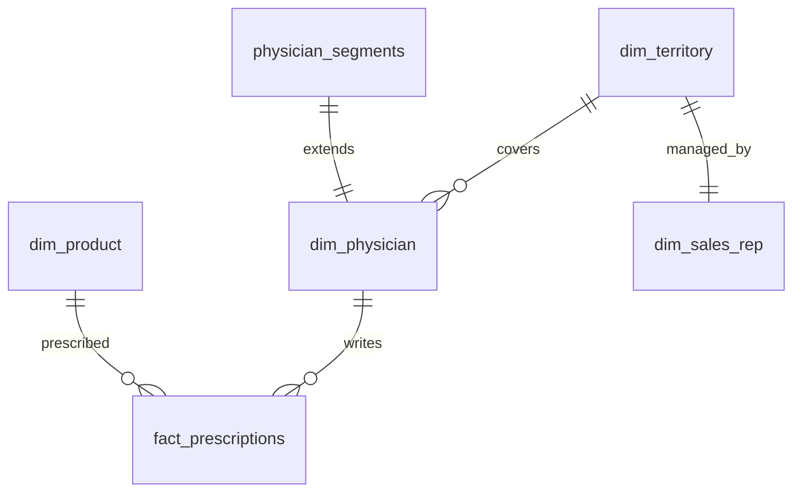

# Power BI Data Model & DAX Guide

## 1. Data Model Architecture

The Power BI model follows a Kimball Dimensional Star Schema centered on the `fact_prescriptions` table and integrated directly with the decile segmentation output (`physician_segments`).



### Table Relationships
- `fact_prescriptions[physician_id]` ➔ `dim_physician[physician_id]` (Many-to-One, Single Filter)
- `fact_prescriptions[product_id]` ➔ `dim_product[product_id]` (Many-to-One, Single Filter)
- `dim_physician[territory_id]` ➔ `dim_territory[territory_id]` (Many-to-One, Single Filter)
- `physician_segments[physician_id]` ➔ `dim_physician[physician_id]` (One-to-One, Bi-directional)

### Data Source Paths
All source tables are located in the `data/raw/` directory:
- `prescriptions.csv` ➔ `fact_prescriptions`
- `physicians.csv` ➔ `dim_physician`
- `products.csv` ➔ `dim_product`
- `territories.csv` ➔ `dim_territory`
- `sales_reps.csv` ➔ `dim_sales_rep`
- `physician_segments.csv` ➔ `physician_segments`

---

## 2. Production DAX Measures

### Prescription Volume & Patient Counts
```dax
Total TRx = SUM('fact_prescriptions'[trx_quantity])

Total NRx = SUM('fact_prescriptions'[nrx_quantity])

New Patient Share % = 
DIVIDE([Total NRx], [Total TRx], 0)

Active Prescribers Count = 
DISTINCTCOUNT('fact_prescriptions'[physician_id])

Avg TRx per Prescriber = 
DIVIDE([Total TRx], [Active Prescribers Count], 0)
```

### Brand vs. Generic Dynamics
```dax
Brand TRx = 
CALCULATE([Total TRx], 'dim_product'[product_type] = "Brand")

Generic TRx = 
CALCULATE([Total TRx], 'dim_product'[product_type] = "Generic")

Brand Share % = 
DIVIDE([Brand TRx], [Total TRx], 0)
```

### Time Intelligence & Growth
```dax
Same Period Last Year TRx = 
CALCULATE(
    [Total TRx], 
    SAMEPERIODLASTYEAR('fact_prescriptions'[rx_date])
)

YoY TRx Growth % = 
VAR CurrentTRx = [Total TRx]
VAR PriorTRx = [Same Period Last Year TRx]
RETURN
DIVIDE(CurrentTRx - PriorTRx, PriorTRx, 0)

Quarterly TRx = 
TOTALQTD([Total TRx], 'fact_prescriptions'[rx_date])
```

### Commercial Target & Priority Allocations
```dax
Priority A Physicians = 
CALCULATE(
    COUNTROWS('physician_segments'), 
    'physician_segments'[priority_bucket] = "A (Protect - Weekly)"
)

Priority B Physicians = 
CALCULATE(
    COUNTROWS('physician_segments'), 
    'physician_segments'[priority_bucket] = "B (Grow - Bi-weekly)"
)

Priority C Physicians = 
CALCULATE(
    COUNTROWS('physician_segments'), 
    'physician_segments'[priority_bucket] = "C (Retain - Monthly)"
)

Priority D Physicians = 
CALCULATE(
    COUNTROWS('physician_segments'), 
    'physician_segments'[priority_bucket] = "D (Monitor - Quarterly)"
)

Platinum Tier Prescribers = 
CALCULATE(
    COUNTROWS('physician_segments'), 
    'physician_segments'[tier] = "Platinum"
)

Target Gap to Budget (5% Growth) = 
VAR TargetTRx = [Same Period Last Year TRx] * 1.05
RETURN
[Total TRx] - TargetTRx
```

---

## 3. Power BI Project Format (.pbip)

This directory includes a native **Power BI Project (`physician_sales_analytics.pbip`)** compatible with modern Power BI Desktop:
- `physician_sales_analytics.pbip`: Main project file. Double-click to launch Power BI Desktop.
- `physician_sales_analytics.Dataset/model.bim`: Pre-defined Tabular Model schema, tables, relationships, and all DAX formulas.
- `physician_sales_analytics.Report/report.json`: Multi-page report definition.
- `PharmaTheme.json`: Pre-configured corporate branding theme (Navy, Teal, Slate).
